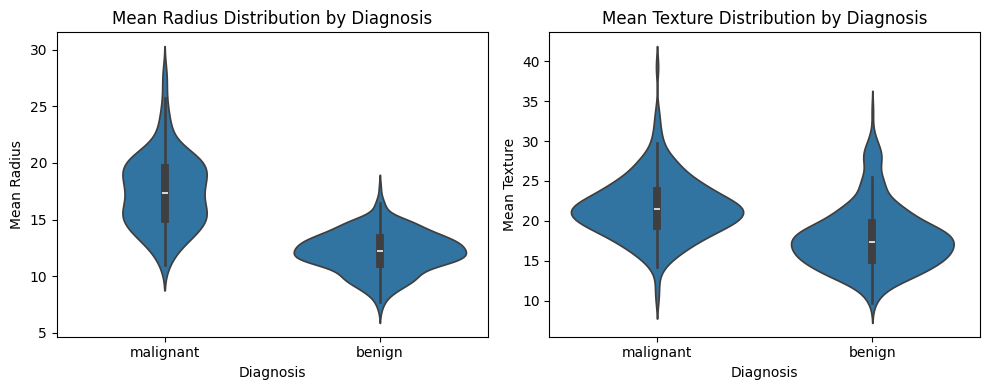

# Breast Cancer Diagnosis Project

**Summary:** This project uses an open-source dataset to build and evaluate a machine learning model for diagnosing breast tumors (benign vs. malignant).

## Introduction
Given the high importance of early breast cancer detection, this project provides a machine learning solution for accurate tumor classification. The project follows data science best practices to ensure the model's performance and reliability.

## Dataset
This project uses the `Breast Cancer Wisconsin (Diagnostic)` dataset from the `scikit-learn` library. The dataset contains 30 numerical features of breast tumors.

## Methodology
The project workflow includes the following steps:

- **Exploratory Data Analysis (EDA):** Examining feature distributions and correlations using `pairplot` and `violinplot`.
-

- **Data Preprocessing:** Using a `Pipeline` to scale features (`MinMaxScaler`) and prevent data leakage.
- **Modeling:** Building a `RandomForestClassifier` for the classification task.
- **Model Evaluation:** Evaluating the model's performance with metrics like Accuracy, Precision, and Recall.

## Results
The `RandomForestClassifier` model provided excellent results:
- **Accuracy (Test):** [Enter your test accuracy here]
- **Precision (Test):** [Enter your test precision here]
- **Recall (Test):** [Enter your test recall here]

## How to Run
To run this project, follow these steps:
1. Open the Jupyter Notebook file in a Colab environment.
2. Run all the cells in sequence.

## Author
- **Name:** Parisa Zeynaly
- **GitHub:** [https://github.com/parisazeynaly](https://github.com/parisazeynaly)
